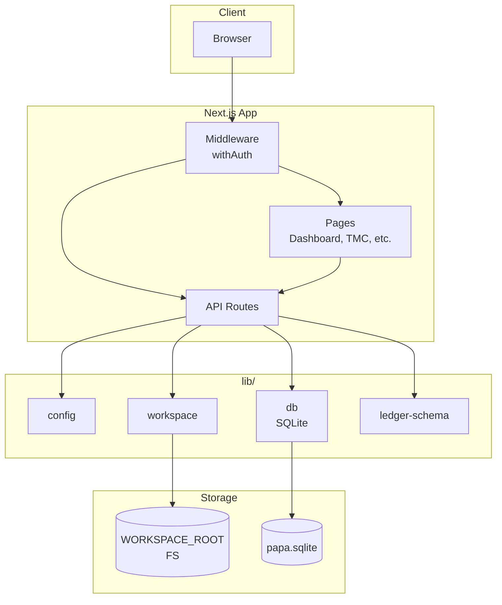

# Архитектурный обзор и предложения по развитию
## papa-app — Программа автоматизации производственной аналитики

**Дата:** 01.02.2026  
**Версия:** 0.1.0

---

## 1. Текущая архитектура (as-is)

### 1.1 Общая архитектура

**Тип:** Modular monolith (монолит с выделенными модулями)

**Подсистемы:**
- **UI** — Next.js App Router, React, Tailwind (дашборд, ТМЦ, заявки, workspace, AI inbox)
- **API** — Route Handlers (`/api/*`)
- **Auth** — NextAuth Credentials (один пользователь из env)
- **Storage** — файловая система (WORKSPACE_ROOT) + SQLite
- **Ledger** — hash-chain событий в `ledger_events`

**Точки входа:**
- Pages: `/`, `/login`, `/tmc/*`, `/tmc-requests/*`, `/workspace`, `/ai-inbox`
- API: `/api/auth/*`, `/api/workspace/*`, `/api/files/*`, `/api/ledger/*`, `/api/tmc/*`
- Middleware: защита маршрутов
- Scripts: `e2e-prepare.mjs`, `e2e-smoke.mjs`

### 1.2 Внутренние связи

```
┌─────────────────────────────────────────────────────────────────────────┐
│                           middleware (withAuth)                          │
│                     защита всех маршрутов кроме auth/login               │
└─────────────────────────────────────────────────────────────────────────┘
                                      │
┌─────────────────────────────────────┴────────────────────────────────────┐
│  App Router Pages          │  API Routes                                  │
│  (page.tsx)                │  (route.ts)                                  │
│  - DashboardLayout         │  - workspace/status, init                    │
│  - Sidebar                 │  - files/list, upload                        │
│  - fetch('/api/...')       │  - ledger/append                             │
│                            │  - tmc/items, lots, requests                 │
└────────────────────────────┼─────────────────────────────────────────────┘
                             │
┌────────────────────────────┴─────────────────────────────────────────────┐
│  lib/                                                                    │
│  - config.ts        → WORKSPACE_ROOT, DB_PATH (env)                       │
│  - db.ts            → getDb() singleton, schema, hashChain                │
│  - workspace.ts     → listWorkspace, resolveWorkspacePath                 │
│  - ledger-schema.ts → validateLedgerAppend (zod)                          │
│  - auth-config.ts   → isCredentialsDefault()                              │
└──────────────────────────────────────────────────────────────────────────┘
                             │
┌────────────────────────────┴─────────────────────────────────────────────┐
│  Внешние ресурсы                                                         │
│  - WORKSPACE_ROOT/ (FS)   - papa.sqlite (better-sqlite3)                  │
│  - env: AUTH_USER, AUTH_PASSWORD, NEXTAUTH_SECRET, WORKSPACE_ROOT         │
└──────────────────────────────────────────────────────────────────────────┘
```

**Связи:**
- **Прямые вызовы:** API routes → lib (getDb, listWorkspace, validateLedgerAppend)
- **Shared libraries:** lib/* импортируются API и не имеют внутренних зависимостей между собой
- **Middleware:** NextAuth withAuth — проверка JWT на каждый запрос
- **Side effects:** FS (readdirSync, writeFileSync), env (process.env), глобальный singleton db

**Границы ответственности:**
- `lib/config` — конфигурация
- `lib/db` — БД, схема, миграции (CREATE IF NOT EXISTS)
- `lib/workspace` — обход FS, защита от path traversal
- `lib/ledger-schema` — валидация событий ledger
- API routes — orchestration, не содержат бизнес-логику

### 1.3 Внешние зависимости

| Зависимость | Роль | Заменимость |
|-------------|------|-------------|
| Next.js 14 | Framework, routing, SSR | Низкая (основа) |
| NextAuth 4 | Auth, JWT, middleware | Средняя (другой auth-провайдер) |
| better-sqlite3 | БД | Высокая (абстракция через getDb) |
| zod | Валидация | Высокая (только ledger-schema) |
| Tailwind | Стили | Высокая |

**Интеграции:**
- **Файловая система** — WORKSPACE_ROOT, директории ai-inbox, 00_SYSTEM/db
- **БД** — один файл SQLite, синхронный доступ
- **Внешние API** — нет

**Жёсткие связи:**
- next-auth + credentials — логин только через env
- better-sqlite3 — нативная Node.js, не работает в Edge
- FS — путь к workspace привязан к серверу

---

### Схема архитектуры (Mermaid)



---

## 2. Масштабирование пользователей и доступов (to-be)

### 2.1 Пользователи и роли

**Текущая модель:** Один пользователь (AUTH_USER/AUTH_PASSWORD), фактически admin.

**Существующая схема RBAC (не используется):**
- Роли: ADMIN, MANAGER, STOREKEEPER, ENGINEER
- Permissions: TMC.MANAGE, TMC.REQUEST.VIEW, TMC.REQUEST.MANAGE, INSPECTION.VIEW, INSPECTION.MANAGE
- Таблицы: rbac_role, rbac_permission, rbac_role_permission

**Предложение по расширению:**

| Роль | Права |
|------|-------|
| ADMIN | Полный доступ, управление пользователями |
| MANAGER | TMC, заявки, техкарты, approve |
| STOREKEEPER | ТМЦ, заявки, техкарты (без approve) |
| ENGINEER | Просмотр заявок и техкарт |
| AUDITOR | Read-only, просмотр ledger |

**Проверка прав:** Policy layer между middleware и API — функция `can(user, permission)` перед выполнением операции.

### 2.2 Ограничения текущей архитектуры для 30+ пользователей

| Компонент | Ограничение |
|-----------|-------------|
| **Auth** | Один пользователь в env; нет хранения пользователей, ролей, сессий в БД |
| **Concurrency** | SQLite — один writer; при 30+ одновременных запросов возможны lock conflicts |
| **Storage** | Один WORKSPACE_ROOT на сервере; нет изоляции по пользователю/арендатору |
| **Файлы** | Нет квот, нет ограничений по пользователю; uploaded_by = 'user' (хардкод) |
| **Ledger** | Append-only, но без привязки к user_id в API |

### 2.3 Рекомендуемая модель

**Выбор: RBAC** — роли уже заданы в схеме, домен (ТМЦ, заявки, техкарты) хорошо ложится на permission-based доступ.

**Хранение прав:**
- `rbac_role`, `rbac_permission`, `rbac_role_permission` — уже есть
- Новая таблица `user` (id, email, password_hash, role_code)
- Или интеграция с внешним IdP (Keycloak, Auth0) — роли в JWT

**Изменения в коде:**
1. Заменить CredentialsProvider на адаптер к таблице user или OAuth/OIDC
2. Добавить `getUserRole(session)` → проверка в API
3. Обернуть каждый API route в `requirePermission(perm_code)`
4. UI — условный рендеринг по ролям

---

## 3. Надёжность, отказоустойчивость, цепочки

### 3.1 Хранение файлов

**Текущее:** WORKSPACE_ROOT на локальном диске сервера.

**Риски:**
- Single point of failure — потеря диска = потеря данных
- Нет репликации, versioning
- Рост данных на одном узле

**Предложения:**

| Вариант | Плюсы | Минусы |
|---------|-------|--------|
| **Object Storage (S3/GCS)** | Масштабируемость, durability, versioning | Миграция кода, стоимость |
| **NFS/shared FS** | Минимальные изменения | SPOF, не HA |
| **Локальный FS + backup** | Простота | Ручное восстановление |

**Рекомендация:** Для 30+ пользователей — S3-compatible storage (MinIO, AWS S3). Абстракция `StorageService` с интерфейсом put/get/delete.

### 3.2 Защита цепочек (ledger)

**Текущее:** Hash-chain в `ledger_events` (prev_hash, block_hash).

**Blockchain vs hash-chain:**
- **Blockchain (public/private):** децентрализация, consensus, immutable audit — избыточно для внутреннего аудита одного приложения
- **Hash-chain:** достаточна для audit trail, верификации порядка событий, обнаружения подделок

**Рекомендация:** Оставить hash-chain. Blockchain имеет смысл только при множестве независимых участников, не доверяющих друг другу.

**Компромисс:** Auditability достигается hash-chain; complexity blockchain не оправдана.

---

## 4. Облачная архитектура

### Вариант 1: Минимальный (cloud-ready)

```
┌─────────────────────────────────────────────────────────┐
│  VPS / single node (Railway, Render, Fly.io, Vercel)    │
│  - Next.js app                                          │
│  - SQLite (или managed DB: Supabase, PlanetScale)       │
│  - WORKSPACE_ROOT → persistent volume                   │
└─────────────────────────────────────────────────────────┘
```

- **Приложение:** один инстанс
- **Данные:** SQLite на volume или миграция на PostgreSQL
- **Отказоустойчивость:** базовый backup, restart при падении

### Вариант 2: Расширенный (HA, DR)

```
┌─────────────────┐     ┌─────────────────┐
│  Load Balancer  │     │  Object Storage │
│  (ALB, Cloud LB)│     │  (S3, GCS)      │
└────────┬────────┘     └────────┬────────┘
         │                       │
    ┌────┴────┐                  │
    │ App x N │                  │
    │ (ECS,   │                  │
    │  Cloud  │                  │
    │  Run)   │                  │
    └────┬────┘                  │
         │                       │
         ▼                       │
┌─────────────────┐              │
│  Managed DB     │              │
│  (RDS, Cloud SQL)              │
└─────────────────┘              │
                                 │
         Файлы (ai-inbox) ───────┘
```

- **Приложение:** несколько инстансов за LB
- **Данные:** PostgreSQL + S3 для файлов
- **Отказоустойчивость:** multi-AZ, автоматические бэкапы, RPO/RTO в SLA

---

## 5. AI-агент: возможности и ограничения

### 5.1 Потенциальные задачи

- Анализ ledger — поиск аномалий, паттернов
- Извлечение данных из документов (накладные, спецификации) — заполнение заявок
- Помощь пользователям — поиск по ТМЦ, подсказки
- Автоматизация проверок — сверка документов с заявками

### 5.2 Архитектурные требования

| Вопрос | Ответ |
|--------|-------|
| Какие данные доступны агенту | Ledger (read-only), file_registry, метаданные файлов; содержимое — по необходимости |
| Граница безопасности | Агент не должен изменять ledger/БД напрямую; только через API с auth |
| Обучение | Offline — на экспорте данных; Online — через stateless API вызовы |
| Embeddings/модели | Отдельное хранилище; не в основной БД |

### 5.3 Риски

- **Утечки данных** — агент не должен получать сырые секреты, PII без необходимости
- **Галлюцинации** — ответы агента не должны автоматически применяться к БД без human-in-the-loop
- **Влияние на логику** — агент как ассистент, не как источник истины; валидация через zod/бизнес-правила

---

## 6. Рекомендации и следующий шаг

### Приоритет 1 (2–4 недели)

*Детальный backlog: [docs/BACKLOG_P1.md](BACKLOG_P1.md)*

1. **RBAC** — подключить существующие таблицы, добавить user/role в сессию, policy layer в API  
   *Трудозатраты: 16–24 ч*
2. **Миграция auth** — таблица user или OAuth; уход от AUTH_USER/AUTH_PASSWORD  
   *Трудозатраты: 12–20 ч*
3. **Пагинация API** — tmc/items, tmc/lots, tmc/requests  
   *Трудозатраты: 8–12 ч*

### Приоритет 2 (1–2 месяца)

4. **PostgreSQL** — при планах 30+ пользователей; SQLite не подходит для concurrent writes  
   *Трудозатраты: 16–24 ч*
5. **Object Storage** — абстракция для файлов, миграция ai-inbox  
   *Трудозатраты: 20–32 ч*
6. **Cloud deployment** — Docker, env-based config, первый деплой  
   *Трудозатраты: 12–20 ч*

### Можно отложить

- Blockchain — hash-chain достаточна
- AI-агент — после стабилизации RBAC и масштабирования
- Multi-tenancy — при появлении требования

### Оценка по этапам

| Этап | Содержание | Часы |
|------|------------|------|
| Этап 1 | RBAC + auth migration | 28–44 |
| Этап 2 | Пагинация + PostgreSQL | 24–36 |
| Этап 3 | Object Storage + cloud | 32–52 |

---

## 7. Decision log (ADR-lite)

| Решение | Контекст | Альтернативы | Обоснование |
|---------|----------|--------------|-------------|
| **Modular monolith** | Выбор архитектурного стиля | Микросервисы | Один домен, одна команда, нет необходимости в независимом деплое компонентов. Микросервисы — избыточны. |
| **RBAC (не OAuth-only)** | Модель доступа | ABAC, только OAuth scopes | Роли уже в схеме; домен (ТМЦ, заявки) — permission-based. ABAC — сложнее без явной потребности. |
| **Hash-chain, не blockchain** | Защита цепочки событий | Blockchain (public/private) | Один доверенный участник; нужны audit trail и целостность. Blockchain добавляет consensus без ценности. |
| **PostgreSQL при 30+ users** | Масштабирование БД | SQLite + WAL, MySQL | SQLite — один writer; при concurrent writes — lock conflicts. PostgreSQL — стандарт для многопользовательских приложений. |
| **Object Storage для файлов** | Масштабирование хранилища | NFS, локальный FS | Durability, versioning, возможность horizontal scaling. Локальный FS — SPOF. |
| **Single-role model** (users.role_code) | Модель ролей в P1 | user_roles many-to-many | Один пользователь = одна роль. Достаточно для MVP 30+ users. Later: добавить user_roles для комбинаций ролей. |
| **bcrypt cost 12** | Параметр хеширования паролей | cost 10, argon2 | cost 12 — баланс безопасность/скорость (2024). argon2 — при следующем цикле обновления auth. |

---

## 8. Scalability envelope

| Метрика | Без изменений (текущее) | Первый bottleneck | Сценарий при 30+ users |
|---------|-------------------------|-------------------|------------------------|
| **Одновременные пользователи** | 3–5 | SQLite write lock | 10+ → конфликты; 30+ → деградация |
| **RPS (запросов/сек)** | ~50–100 | SQLite, один инстанс | Пики записи блокируют чтение |
| **Объём файлов** | До ~10 GB | Диск, backup время | Рост без квот → переполнение |
| **Размер ledger** | Десятки тыс. записей | — | Hash-chain масштабируется линейно |

**Вывод:** Система комфортно работает **до ~5–10 одновременных пользователей** при типичной нагрузке. Для 30+ требуются изменения из Приоритета 1–2.

---

## 9. Risk register

| Риск | Вероятность | Влияние | Mitigation |
|------|-------------|---------|------------|
| Потеря данных (диск, сбой) | Средняя | Критическое | Backup WORKSPACE_ROOT + SQLite; в перспективе — S3, managed DB |
| SQLite lock при росте нагрузки | Высокая | Высокое | Миграция на PostgreSQL до 30+ users |
| Утечка учётных данных (default creds) | Низкая | Критическое | Fail-fast в production, баннер, checklist |
| Path traversal / инъекции | Низкая | Высокое | Реализовано: resolveWorkspacePath, zod |
| Преждевременная интеграция AI | Средняя | Среднее | AI — read-only, human-in-the-loop; отложить до RBAC |

---

## Критерий успеха

По итогам документа можно:

- Принять решение о целесообразности доработок под 30+ пользователей
- Выбрать архитектурный вектор (простота vs enterprise)
- Сформировать roadmap на 2–3 этапа с оценкой трудозатрат
